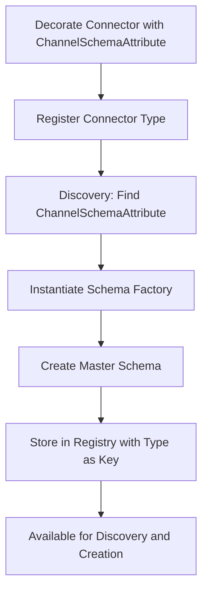

# Channel Registry - Attribute-Driven Implementation Summary

## ?? **Implementation Overview**

This document summarizes the **attribute-driven Channel Registry implementation** that addresses all your objections to the previous registry-based pattern. The new implementation provides a self-describing connector system where schemas are discovered through metadata attributes.

## ?? **Objections Addressed**

### ? **1. ChannelSchemaAttribute Implementation**
- **New**: `ChannelSchemaAttribute` attribute decorates connector implementations
- **New**: `IChannelSchemaFactory` interface for creating schema instances
- **New**: Schema factories provide the reference schema for each connector type

```csharp
[ChannelSchema(typeof(TwilioSmsSchemaFactory))]
public class TwilioSmsConnector : ChannelConnectorBase
{
    // Connector implementation
}

public class TwilioSmsSchemaFactory : IChannelSchemaFactory
{
    public IChannelSchema CreateSchema()
    {
        return new ChannelSchema("Twilio", "SMS", "2.1.0")
            .WithCapabilities(ChannelCapability.SendMessages | ChannelCapability.ReceiveMessages)
            // ... additional configuration
    }
}
```

### ? **2. No Manual Channel ID Parameters**
- **Removed**: All `channelId` parameters from registration methods
- **New**: Connector types serve as unique identifiers (one instance per type)
- **New**: Registration is based purely on connector type

```csharp
// OLD approach (removed)
registry.RegisterChannel<TwilioSmsConnector>("twilio-sms", schema);

// NEW approach (implemented)
registry.RegisterConnector<TwilioSmsConnector>();
```

### ? **3. Automatic Schema Discovery**
- **Enforced**: Registration fails if connector lacks `ChannelSchemaAttribute`
- **Automatic**: Schema discovery through reflection and attribute metadata
- **Validated**: Schema factories are instantiated and validated during registration

```csharp
// Automatic discovery - no manual schema parameter
services.AddChannelRegistry()
    .RegisterConnector<TwilioSmsConnector>()
    .RegisterConnector<SendGridEmailConnector>();
```

### ? **4. Discovery by Provider and Type**
- **New**: `FindSchemaByProviderAndType(string provider, string type)` method
- **New**: `FindConnectorTypeByProviderAndType(string provider, string type)` method
- **Enhanced**: Query capabilities for schema discovery

```csharp
// Find by provider and type
var twilioSchema = registry.FindSchemaByProviderAndType("Twilio", "SMS");
var connectorType = registry.FindConnectorTypeByProviderAndType("Twilio", "SMS");
```

### ? **5. Scalable Query Conditions**
- **New**: `QuerySchemas(Func<IChannelSchema, bool> predicate)` method
- **Enhanced**: Flexible querying with lambda expressions
- **Examples**: Query by any schema property or combination

```csharp
// Query all SMS schemas
var smsSchemas = registry.QuerySchemas(s => s.ChannelType == "SMS");

// Query schemas with bulk messaging capability
var bulkSchemas = registry.QuerySchemas(s => 
    s.Capabilities.HasFlag(ChannelCapability.BulkMessaging));

// Query by provider pattern
var twilioSchemas = registry.QuerySchemas(s => 
    s.ChannelProvider.StartsWith("Twilio"));
```

### ? **6. Sealed ChannelRegistryBuilder**
- **Removed**: `IChannelRegistryBuilder` interface abstraction
- **New**: `ChannelRegistryBuilder` is now a sealed concrete class
- **Simplified**: Direct usage without interface layer

```csharp
// No interface - direct sealed class usage
public sealed class ChannelRegistryBuilder
{
    public ChannelRegistryBuilder RegisterConnector<TConnector>() { ... }
    public ChannelRegistryBuilder RegisterConnector(Type connectorType) { ... }
}
```

## ??? **New Architecture**

### **Core Components**

1. **`ChannelSchemaAttribute`** - Metadata attribute for schema discovery
2. **`IChannelSchemaFactory`** - Interface for schema creation
3. **`ConnectorDescriptor`** - Metadata about registered connectors (replaces ChannelDescriptor)
4. **`ChannelRegistryBuilder`** - Sealed builder for fluent registration
5. **`ChannelRegistry`** - Thread-safe registry implementation

### **Registration Flow**



### **Usage Patterns**

#### **Service Registration**
```csharp
services.AddChannelRegistry()
    .RegisterConnector<TwilioSmsConnector>()
    .RegisterConnector<SendGridEmailConnector>()
    .RegisterConnector<FirebasePushConnector>();
```

#### **Schema Discovery**
```csharp
// By connector type
var schema = registry.GetMasterSchema<TwilioSmsConnector>();

// By provider and type
var schema = registry.FindSchemaByProviderAndType("Twilio", "SMS");

// By query conditions
var schemas = registry.QuerySchemas(s => s.ChannelType == "SMS");
```

#### **Connector Creation**
```csharp
// With master schema
var connector = await registry.CreateConnectorAsync<TwilioSmsConnector>();

// With runtime schema (validated against master)
var customerSchema = new ChannelSchema(masterSchema, "Customer Specific")
    .RemoveCapability(ChannelCapability.ReceiveMessages);
var connector = await registry.CreateConnectorAsync<TwilioSmsConnector>(customerSchema);
```

## ?? **API Changes Summary**

### **Registry Interface (IChannelRegistry)**

| Old Method | New Method | Change |
|------------|------------|---------|
| `RegisterChannel<T>(string id, schema)` | `RegisterConnector<T>()` | ? Removed channel ID, automatic schema discovery |
| `GetMasterSchema(string id)` | `GetMasterSchema<T>()` | ? Type-based lookup, no IDs |
| `CreateConnectorAsync(string id)` | `CreateConnectorAsync<T>()` | ? Type-based creation |
| `GetChannelDescriptors()` | `GetConnectorDescriptors()` | ? Connector-focused metadata |
| ? Not available | `FindSchemaByProviderAndType()` | ? New discovery method |
| ? Not available | `QuerySchemas(predicate)` | ? New flexible querying |

### **Builder Interface**

| Old Interface | New Implementation | Change |
|---------------|-------------------|--------|
| `IChannelRegistryBuilder` | `ChannelRegistryBuilder` (sealed) | ? Removed interface abstraction |
| `RegisterChannel<T>(id, schema)` | `RegisterConnector<T>()` | ? Simplified registration |

## ?? **Testing**

- **? 38 Tests Passing** - All Channel Registry functionality tested
- **? Attribute Discovery** - Tests for missing attributes and validation
- **? Query Methods** - Comprehensive testing of discovery methods
- **? Type Safety** - Validation of connector type registration
- **? Runtime Schema Validation** - Compatibility testing

### **Test Coverage**
- Registration with and without attributes
- Schema discovery and validation
- Query methods (by type, provider, conditions)
- Connector creation with master and runtime schemas
- Error handling for invalid scenarios

## ?? **Benefits of New Approach**

### **?? Simplified Registration**
- No manual channel IDs to manage
- Automatic schema discovery reduces configuration errors
- One connector type = one registration (prevents duplicates)

### **?? Enhanced Discovery**
- Flexible querying with lambda expressions
- Multiple discovery methods (type, provider/type, conditions)
- IntelliSense support for type-based operations

### **??? Type Safety**
- Compile-time checking of connector types
- Automatic validation of schema attributes
- Reduced runtime configuration errors

### **?? Better Organization**
- Self-documenting connectors through attributes
- Clear separation of concerns (connector vs. schema factory)
- Consistent pattern across all connector implementations

## ?? **Examples and Documentation**

### **Complete Connector Example**
```csharp
// Schema factory
public class TwilioSmsSchemaFactory : IChannelSchemaFactory
{
    public IChannelSchema CreateSchema()
    {
        return new ChannelSchema("Twilio", "SMS", "2.1.0")
            .WithDisplayName("Twilio SMS Master Schema")
            .WithCapabilities(
                ChannelCapability.SendMessages |
                ChannelCapability.ReceiveMessages |
                ChannelCapability.MessageStatusQuery)
            .AddParameter(new ChannelParameter("AccountSid", DataType.String)
            {
                IsRequired = true,
                Description = "Twilio Account SID"
            })
            .AddParameter(new ChannelParameter("AuthToken", DataType.String)
            {
                IsRequired = true,
                IsSensitive = true,
                Description = "Twilio Auth Token"
            })
            .HandlesMessageEndpoint(EndpointType.PhoneNumber)
            .AddContentType(MessageContentType.PlainText);
    }
}

// Connector implementation
[ChannelSchema(typeof(TwilioSmsSchemaFactory))]
public class TwilioSmsConnector : ChannelConnectorBase
{
    public TwilioSmsConnector(IChannelSchema schema) : base(schema) { }
    
    // Implementation methods...
}
```

### **Usage in Applications**
```csharp
// Registration
services.AddChannelRegistry()
    .RegisterConnector<TwilioSmsConnector>();

// Discovery and Usage
var registry = serviceProvider.GetRequiredService<IChannelRegistry>();

// Find SMS connectors
var smsConnectors = registry.GetConnectorDescriptors(d => 
    d.ChannelType.Equals("SMS", StringComparison.OrdinalIgnoreCase));

// Create connector
var connector = await registry.CreateConnectorAsync<TwilioSmsConnector>();
```

## ? **Implementation Status**

- **? Complete** - All requested features implemented
- **? Tested** - Comprehensive test suite passing
- **? Documented** - Examples and usage guides provided
- **? Compiled** - Clean build with no errors
- **?? Ready** - Ready for your review and feedback

---

**The new attribute-driven Channel Registry implementation fully addresses all your objections while providing a more intuitive, type-safe, and discoverable API for connector management.**